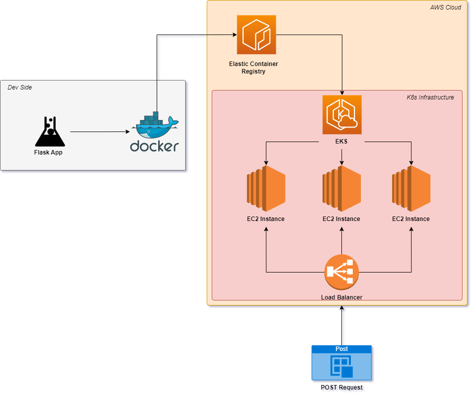

# Sample AWS Kubernetes (K8s) Flask App Deployment

# Description
A simple walkthrough and template for kubernetes (k8s) flask app deployments on the AWS cloud. The solution leverages AWS' Elastic K8s Service (EKS) to manage clusters on the public cloud. The code here provides both the infrastructure as code (IaC) components and a simple application script to handle the flask API. 

# Contents

## app 
This folder contains the code for the application image. 
- Dockerfile contains the instructions for building an image
- app.py contains the flask app
- requirements.txt has all of the dependancies for the application

## kubernetes
This folder contains the kubernetes and EKS configurations. 
- cluster.yml EKS cluster configuration script
- models-deployment.yml K8s deployment script
- models-service.yml K8s service script

## solution architecture
The diagram below outlines the major components of the solution. 

## Implementation Instructions
1. Use docker cli to build image locally `docker build -t <image_tag> .`
2. Install AWS cli and ensure you set permissions with `aws configure`
3. Create ECR registry and push image to ECR repo
4. Install eksctl and kubectl 
5. Create cluster config file 
6. Configure and launch cluster with eksctl `eksctl create cluster -f cluster.yaml`
7. Create kubernetes namespace `kubectl create namespace <namespace>`
8. Create kubernetes deployment and service .yml files
10. Create deployment using `kubectl apply -f <filename>`
11. Create service using `kubectl apply -f <filename>`
12. Check for status of deployment and service using `kubectl -n <namespace> get all`
13. Retrieve load balancer external IP and make a HTTP request to test app 

## Troubleshooting
1. EKS resources such as pods, replica groups, and nodes won't show up in AWS console unless you a IAM policy that gives you access. EKS resource details are not available on aws cli or eks sdk. 
2. To force update pods with new image, update the name of the container in the deployment file and apply again. 
3. If you want to access as a pod shell you can use `kubectl exec -it <pod id> -n <namespace> -- bash` (not recommended to have bash or powershell installed on production images) 

